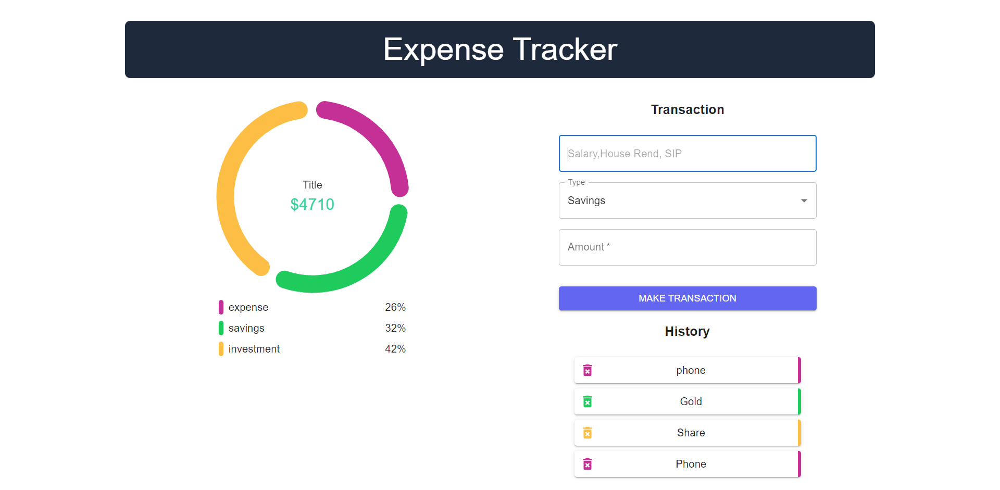

# typescript-expense-tracker

It is a simple expense tracker app. It is written in typescript and uses react.

## Table of Packages

| Client           | Server       |
| ---------------- | ------------ |
| Typescript       | Typescript   |
| React            | express      |
| Redux            | mongoose     |
| React-Redux      | cors         |
| Redux-toolkit    | morgan       |
| RTK-query        | dotenv       |
| Redux-persist    | helmet       |
| MUI              | bcrypt       |
| react-router-dom | jsonwebtoken |
| react-hook-form  | multer       |
| react-lottie     | cloudinary   |

live Link: https://objective-clarke-be1021.netlify.app/

server link: https://typescript-expense-tracker.herokuapp.com/api/v1
